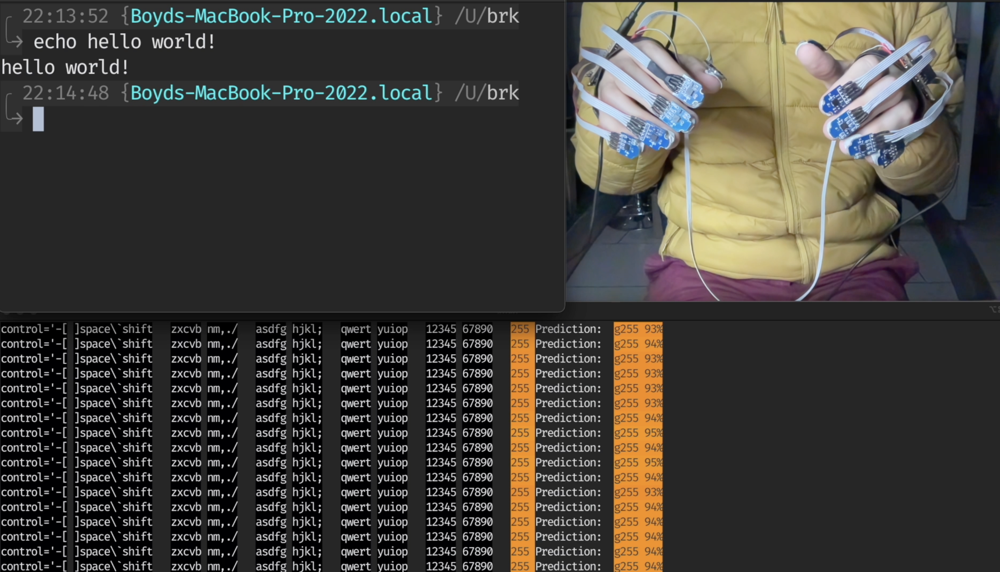

# Overview: Converting sensor data to keystrokes

:::::::::::::: {.columns}
::: {.column width="40%"}

- _Ergo_ collects sensor data
- Classifier makes gesture predictions
- OS receives keystroke commands
  :::
  ::: {.column width="60%"}

\begin{tikzpicture}[node distance = 4cm, auto]
\tikzstyle{block} = [rectangle, draw=mLightBrown, text width=5em, text centered, rounded corners, minimum height=4em]
\tikzstyle{line} = [draw, -latex']
% Place nodes
\node [block] (ergo) {\emph{Ergo} hardware};
\node [block, right of=ergo] (class) {Classifier};
\node [block, below of=class] (g2k) {Gesture to keystroke mapping};
\node [block, left of=g2k] (os) {Operating System};
% Draw edges
\path [line] (ergo) -> node[anchor=north] {Sensor data} (class);
\path [line] (class) -> node[anchor=east] {Gesture predictions} (g2k);
\path [line] (g2k) -> node[anchor=north] {Keystrokes} (os);
\end{tikzpicture}

:::
::::::::::::::

::: notes

1. Sensors on your fingertips measure acceleration
2. acceleration measurements get fed to a classifier 40 times per second
3. Classifier predicts a keystroke 40 time per second
4. The transition from no gesture to some gesture is passed to the OS as a
   keystroke
   :::

# Hardware

:::::::::::::: {.columns}
::: {.column width="40%"}

- Custom designed
- Ten accelerometers
- 30-dimensional time series
- Sampled 40 times per second
  :::
  ::: {.column width="60%"}
  
  :::
  ::::::::::::::

# Gestures

:::::::::::::: {.columns}
::: {.column width="40%"}

\metroset{block=fill}
\begin{exampleblock}{Example}
Gesture to keystroke configuration file:
\begin{verbatim}
gestures:
gesture0030: q
gesture0031: w
gesture0032: e
gesture0033: r
gesture0034: t
...
\end{verbatim}
\end{exampleblock}
` `
:::
::: {.column width="60%"}

- Each keystoke is paired with a gesture
- 50 keystrokes are needed:
  - a--z
  - 0--9
  - punctuation
  - control characters
- 50 gestures: 10 movements $\times$ 5 orientations
- Gestures are mapped to keystrokes via a configuration file

`gesture0255`: represents all time periods when the hands are still

:::
::::::::::::::

# Example gesture

::: notes

- This plot shows the raw sensor readings while gesture0001 was being
  performed
- Each plot shows the sensor readings from one finger. This bump here is the
  left ring finger performing gesture0001
  :::

# A quick video {.standout}

::: notes
Go through video
:::

# Preprocessing

Better model performance by providing a window of sensor measurements

# Model Architecture

Chosen model: feed-forward neural network with dropout and two hidden layers

Neural Network advantages:

- Relatively fast inference and training
  - 200 000+ observations
  - 300+ dimensions per observation
- Very few assumptions about the distribution of the data
- Good performance on highly imbalanced datasets
- Infrastructure exists to deploy Neural Networks directly onto
  microcontrollers.

Loss function: Categorical Cross Entropy

# Model Selection

Randomly chosen hyperparameter combinations were chosen and trained for 15
epochs

\begin{table}
\centering
\caption{Distribution of Hyperparameter values}
\begin{tabular}{ll}
\textbf{Hyperparameter} & \textbf{Values} \\
\hline
Activation Function & ReLU or ELU \\
Batch Size & 16, 32, 64, 128, 256, 512 \\
Dropout Fraction & $[0.5, 0.8]$ \\
Learning Rate & $[0.0001, 0.1]$ \\
Hidden units in layer 1 & $16, 17, 18, \ldots, 256$\\
Hidden units in layer 2 & $16, 17, 18, \ldots, 256$\\
Optimiser & ADAM, SGD, or RMSProp \\
\texttt{window_size} & $5, 6, 7, \ldots, 40$ \\
\texttt{label_expansion} & $1, 2, 3, \ldots, 10$\\
\hline
\end{tabular}
\end{table}

# Loss functions and experienced accuracy

\begin{tikzpicture}
\draw[<->] (0,0) -- (8,0);
\foreach \x in {1,2,...,7}{
\draw (\x cm,0.1cm) -- (\x cm,-0.1cm);
}
\node[anchor=north, color=incorrectRed] at (1,0) {\texttt{g001}};
\node[anchor=north, color=mLightGreen] at (2,0) {\texttt{g001}};
\node[anchor=north, color=incorrectRed] at (7,0) {\texttt{g001}};
\node[anchor=east] at (0,0) {Inconsistent Model};

    \draw[<->] (0,1) -- (8,1);
    \foreach \x in {1,2,...,7}{
        \draw (\x cm,1.1cm) -- (\x cm,0.9cm);
    }
    \node[anchor=north, color=mLightGreen] at (4,1) {\texttt{g001}};
    \node[anchor=north, color=incorrectRed] at (5,1) {\texttt{g001}};
    \node[anchor=north, color=incorrectRed] at (6,1) {\texttt{g001}};
    \node[anchor=east] at  (0,1) {Delayed Model};

    \draw[<->] (0,2) -- (8,2);
    \foreach \x in {1,2,...,7}{
        \draw (\x cm,2.1cm) -- (\x cm,1.9cm);
    }
    \node[anchor=north] at (2,2) {\texttt{g001}};
    \node[anchor=north] at (3,2) {\texttt{g001}};
    \node[anchor=north] at (4,2) {\texttt{g001}};
    \node[anchor=east] at  (0,2) {True Labels};

\end{tikzpicture}

- **Delayed model** predicts perfectly, but with a delay of 2 time steps
- **Inconsistent model** has the same accuracy as the delayed model, but
  predicts the correct gesture without a pattern

Delayed model is a better user experience, despite having the same accuracy

Solution: Dynamic Time Warping

# Best performing model

\begin{table}
\centering
\caption{Best hyperparameter values found after training 53 models}
\begin{tabular}{ll}
\textbf{Hyperparameter} & \textbf{Value} \\
\hline
Activation Function & ELU \\
Batch Size & $128$ \\
Dropout Fraction & $0.522$ \\
Learning Rate & $0.000261$ \\
Hidden units in layer 1 & $54$\\
Hidden units in layer 2 & $150$\\
Optimiser & RMSProp \\
\texttt{window_size} & $23$ \\
\texttt{label_expansion} & $10$\\
\hline
\end{tabular}
\end{table}

# Results: Loss

# Results: Confusion Matrix

# Testing

Dependence on live sensor input increased the difficulty of testing

Unit test coverage:

- Machine learning & plotting functions: 51%
- Sensor measurement code: 28%

# Thanks! {.standout}

Some question ideas:

What does a PCA plot of the sensor data look like?

Why didn't you use machine learning technique X?

What is your electrical engineering background?

What is the next improvement that will be made?

How is the dataset collected?

# So glad you asked

<!-- prettier-ignore-end -->
